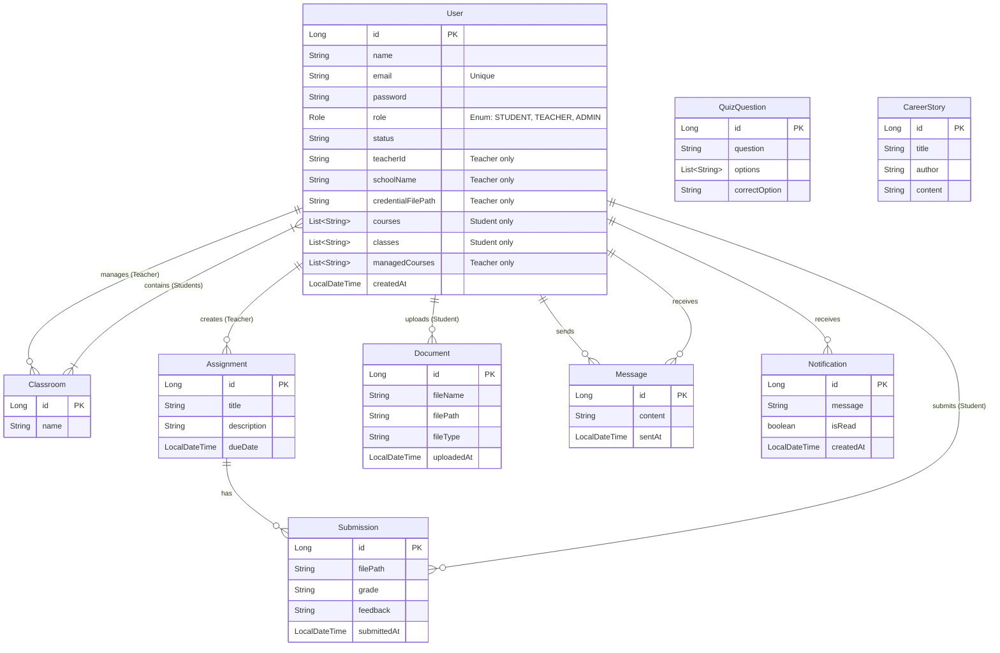

# Entity Relationship Diagram (ERD)

This document provides a detailed Entity Relationship Diagram (ERD) for the EdTech backend project, based on the current data models.

## Diagram

## detailed Entity Descriptions

### User
Represents all users in the system (Students, Teachers, Admins).
- **id**: Primary Key.
- **role**: Determines the user type (STUDENT, TEACHER, ADMIN).
- **teacherId, schoolName, credentialFilePath**: Specific to Teachers.
- **courses, classes**: Specific to Students (Strings, likely legacy or simple lists).
- **managedCourses**: Specific to Teachers.

### Classroom
Represents a class managed by a teacher and containing students.
- **teacher**: The owner of the classroom.
- **students**: The students enrolled in the classroom.

### Assignment
Tasks created by teachers for students.
- **teacher**: The creator of the assignment.

### Submission
Work submitted by a student for an assignment.
- **assignment**: The related assignment.
- **student**: The student who submitted.
- **filePath**: Link to the submitted file.
- **grade, feedback**: Evaluation details.

### Document
Files uploaded by students (e.g., resources, simple uploads).
- **student**: The uploader.

### Message
Communication between users.
- **sender**: User sending the message.
- **receiver**: User receiving the message.

### Notification
System notifications for users.
- **user**: The recipient.

### QuizQuestion
Standalone entity for quiz questions (currently not linked to other entities).

### CareerStory
Standalone entity for career stories/blogs.
