# Physical Entity Relationship Diagram (ERD)

This document represents the physical data model for the EdTech backend project. It maps the entities to database tables with SQL types and explicit relationships.

## Legend
- **PK**: Primary Key
- **FK**: Foreign Key
- **VARCHAR(255)**: Variable length string (default)
- **TEXT**: Long text
- **TIMESTAMP**: Date and time
- **BIGINT**: 64-bit integer

```mermaid
erDiagram
    users {
        BIGINT id PK "AUTO_INCREMENT"
        VARCHAR(255) name "NOT NULL"
        VARCHAR(255) email "NOT NULL, UNIQUE"
        VARCHAR(255) password "NOT NULL"
        VARCHAR(255) role "ENUM('STUDENT', 'TEACHER', 'ADMIN')"
        VARCHAR(255) status "ACTIVE, PENDING"
        VARCHAR(255) teacher_id "Nullable"
        VARCHAR(255) school_name "Nullable"
        VARCHAR(255) credential_file_path "Nullable"
        TIMESTAMP created_at
    }

    user_courses {
        BIGINT user_id FK
        VARCHAR(255) course
    }

    user_classes {
        BIGINT user_id FK
        VARCHAR(255) class_name
    }

    user_managed_courses {
        BIGINT user_id FK
        VARCHAR(255) managed_course
    }

    classroom {
        BIGINT id PK "AUTO_INCREMENT"
        VARCHAR(255) name
        BIGINT teacher_id FK
    }

    classroom_students {
        BIGINT classroom_id FK
        BIGINT student_id FK
    }

    assignment {
        BIGINT id PK "AUTO_INCREMENT"
        VARCHAR(255) title
        VARCHAR(255) description
        TIMESTAMP due_date
        BIGINT teacher_id FK
    }

    submission {
        BIGINT id PK "AUTO_INCREMENT"
        BIGINT assignment_id FK
        BIGINT student_id FK
        VARCHAR(255) file_path
        VARCHAR(255) grade
        VARCHAR(255) feedback
        TIMESTAMP submitted_at
    }

    document {
        BIGINT id PK "AUTO_INCREMENT"
        VARCHAR(255) file_name
        VARCHAR(255) file_path
        VARCHAR(255) file_type
        BIGINT student_id FK
        TIMESTAMP uploaded_at
    }

    message {
        BIGINT id PK "AUTO_INCREMENT"
        BIGINT sender_id FK
        BIGINT receiver_id FK
        VARCHAR(255) content
        TIMESTAMP sent_at
    }

    notification {
        BIGINT id PK "AUTO_INCREMENT"
        BIGINT user_id FK
        VARCHAR(255) message
        BOOLEAN is_read
        TIMESTAMP created_at
    }

    quiz_question {
        BIGINT id PK "AUTO_INCREMENT"
        VARCHAR(255) question
        VARCHAR(255) correct_option
    }

    quiz_question_options {
        BIGINT quiz_question_id FK
        VARCHAR(255) option_text
    }

    career_story {
        BIGINT id PK "AUTO_INCREMENT"
        VARCHAR(255) title
        VARCHAR(255) author
        TEXT content
    }

    %% Relationships

    users ||--o{ user_courses : "has"
    users ||--o{ user_classes : "has"
    users ||--o{ user_managed_courses : "has"
    
    users ||--o{ classroom : "owns (as teacher)"
    classroom ||--o{ classroom_students : "has"
    users ||--o{ classroom_students : "enrolled in"

    users ||--o{ assignment : "creates"
    assignment ||--o{ submission : "receives"
    users ||--o{ submission : "submits"

    users ||--o{ document : "uploads"
    users ||--o{ message : "sends"
    users ||--o{ message : "receives"
    users ||--o{ notification : "receives"

    quiz_question ||--o{ quiz_question_options : "has"
```

## Table Design Notes

### `users` Table
- Stores all user types. Discriminator logic is handled by the `role` column or application logic.
- Teacher-specific fields (`teacher_id`, `school_name`) are nullable.

### Collections as Tables
Since `List<String>` cannot be stored directly in a relational column, they are normalized into separate tables:
- `user_courses`
- `user_classes`
- `user_managed_courses`
- `quiz_question_options`

### Many-to-Many Relationships
The relationship between `Classroom` and `Student` (User) is managed by the join table:
- `classroom_students` (`classroom_id`, `student_id`)

### Foreign Keys
All relationships are enforced via Foreign Keys pointing to the `id` of the parent table.
